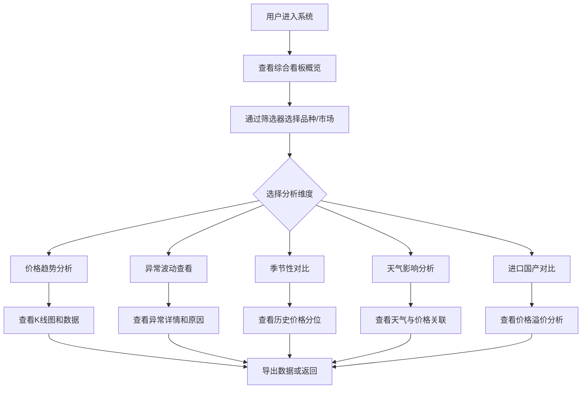

## 1. 产品概述

全国水果批发市场价格行情看板系统是一个专业级的数据可视化平台，为水果批发商、零售商、采购商及行业分析师提供实时、全面的水果价格行情数据和深度分析工具。

- 核心目标：解决水果流通环节中价格信息不对称的痛点，帮助用户做出更精准的采购、定价和库存决策
- 目标用户：水果批发商、连锁超市采购、生鲜电商运营、农业经济分析师
- 市场价值：通过数据驱动的价格预测和异常预警，降低流通成本，提高行业效率

## 2. 核心功能

### 2.1 用户角色

| 角色 | 注册方式 | 核心权限 |
|------|---------|---------|
| 行业用户 | 无需注册（演示版） | 浏览所有行情数据、使用分析工具、导出数据 |

### 2.2 功能模块

1. **综合看板首页**：核心价格指标概览、市场热力图、TOP涨跌榜、快速筛选
2. **价格趋势分析**：按品种展示近7/30/90天K线图、支持多市场对比
3. **价格异常检测**：自动识别价格异常波动、提供原因标注、异常时间线
4. **季节性价格分析**：3年历史价格叠加、分位水平计算、季节性规律可视化
5. **产地天气影响分析**：主要产区天气预警标注、价格滞后影响分析
6. **进口与国产对比**：进口水果与国产同类价格对比、品质溢价分析

### 2.3 页面详情

| 页面名称 | 模块名称 | 功能描述 |
|---------|---------|---------|
| 综合看板首页 | 数据概览卡片 | 展示今日均价指数、涨跌幅、异常预警数量等核心指标 |
| 综合看板首页 | 品种筛选器 | 支持按品类、产地、市场多维度筛选 |
| 综合看板首页 | 市场价格热力图 | 地理热力图展示全国各区域价格水平 |
| 综合看板首页 | TOP涨跌榜 | 展示日涨幅/跌幅最大的前10个品种 |
| 综合看板首页 | 价格行情表格 | 所有品种最新报价明细，支持排序和搜索 |
| 价格趋势分析 | 时间周期切换 | 7天/30天/90天切换按钮 |
| 价格趋势分析 | K线图表 | OHLC K线图，包含成交量、MA均线 |
| 价格趋势分析 | 多市场对比 | 同品种不同批发市场价格曲线叠加 |
| 价格异常检测 | 异常列表 | 所有价格异常事件列表，按严重程度排序 |
| 价格异常检测 | 异常详情 | 异常波动幅度、可能原因、历史对比 |
| 季节性价格分析 | 历史叠加图 | 近3年同期价格曲线叠加展示 |
| 季节性价格分析 | 分位指示器 | 当前价格在历史区间的分位水平展示 |
| 产地天气影响分析 | 天气时间轴 | 主要产区天气事件在时间轴上标注 |
| 产地天气影响分析 | 影响分析 | 天气事件与后续价格波动的相关性分析 |
| 进口与国产对比 | 价格对比表 | 进口与国产同品类价格、品质对比 |
| 进口与国产对比 | 溢价趋势图 | 进口水果历史溢价率变化趋势 |

## 3. 核心流程

## 4. 用户界面设计

### 4.1 设计风格

- **主色调**：森林绿 #2D6A4F（代表新鲜、农业、信任），搭配暖橙 #F77F00（作为强调色，代表价格、警示）
- **辅助色**：深青绿 #1B4332、浅绿 #95D5B2、米白 #F8F9FA、深灰 #212529
- **按钮风格**：圆角6px，微阴影，hover时轻微上浮和加深
- **字体**：标题使用 Noto Serif SC（衬线体增加专业感），正文使用 Noto Sans SC（清晰易读）
- **布局风格**：卡片式布局，顶部导航+侧边筛选栏+主内容区
- **图标风格**：线性图标，统一使用 Lucide React

### 4.2 页面设计概述

| 页面名称 | 模块名称 | UI元素 |
|---------|---------|--------|
| 综合看板首页 | 顶部导航栏 | 品牌Logo、系统标题、当前日期、数据更新时间、导出按钮 |
| 综合看板首页 | 数据概览卡片 | 4个大尺寸指标卡片，带箭头趋势指示和同比环比数据 |
| 综合看板首页 | 筛选区域 | 品种多选、市场单选、日期范围选择器，卡片式容器 |
| 综合看板首页 | 涨跌榜 | 左右两列对比布局，红色上涨绿色下跌，带进度条动画 |
| 综合看板首页 | 价格表格 | 斑马纹表格，悬浮高亮，数字右对齐，涨跌幅颜色标识 |
| 价格趋势分析 | 图表区 | 大号K线图占据主要空间，底部缩略图导航，支持缩放平移 |
| 价格异常检测 | 异常卡片 | 时间线布局，异常事件卡片带颜色标识和原因标签 |
| 季节性价格分析 | 多线对比图 | 不同年份用不同透明度曲线叠加，当前年加粗高亮 |
| 产地天气影响分析 | 混合图表 | 价格曲线+天气事件标记点（图标+tooltip） |

### 4.3 响应式设计

- 采用桌面优先（Desktop-first）设计
- 断点：1200px（大屏）、992px（平板横屏）、768px（平板竖屏）、576px（手机）
- 移动端：侧边栏变为底部Tab，表格改为卡片列表，图表自适应缩放
- 触控优化：按钮最小44px，图表支持双指缩放

### 4.4 动效设计

- 页面加载：卡片依次淡入（staggered fade-in），数据数字滚动动画
- 图表交互：tooltip淡入淡出，数据点hover放大，柱条hover高亮
- 筛选切换：图表平滑过渡（300ms ease），不出现空白闪烁
- 异常警示：呼吸灯动画（pulse），红色边框轻微闪烁
