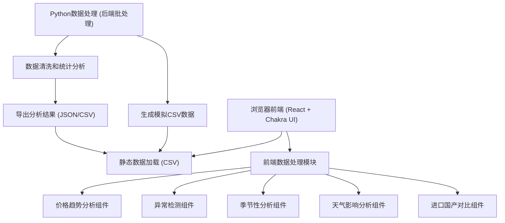

## 1. 架构设计



## 2. 技术说明

### 前端技术栈
- **框架**: React 18 + TypeScript
- **构建工具**: Vite 5
- **UI组件库**: Chakra UI 2.x
- **数据可视化**: Recharts 2.x + lightweight-charts (K线图)
- **状态管理**: Zustand 4
- **路由**: React Router DOM 6
- **图标**: Lucide React
- **数据处理**: Papaparse (CSV解析) + date-fns (日期处理)

### 后端技术栈 (Python数据处理)
- **Python版本**: 3.10+
- **数据处理**: Pandas 2.x, NumPy 1.x
- **统计分析**: SciPy
- **数据生成**: Faker (模拟数据生成)

### 数据源
- 模拟CSV文件，包含：
  - 每日价格数据 (daily_prices.csv)
  - 市场信息 (markets.csv)
  - 品种信息 (fruits.csv)
  - 异常事件 (anomalies.csv)
  - 天气事件 (weather_events.csv)
  - 历史年度数据 (historical_prices/)

## 3. 路由定义

| 路由 | 页面 | 功能说明 |
|------|------|---------|
| `/` | 综合看板首页 | 核心指标概览、涨跌榜、价格表格 |
| `/trend` | 价格趋势分析 | K线图、多市场对比、时间周期切换 |
| `/anomaly` | 价格异常检测 | 异常列表、异常详情、时间线 |
| `/seasonal` | 季节性价格分析 | 3年历史叠加、分位计算 |
| `/weather` | 产地天气影响 | 天气时间轴、价格影响分析 |
| `/import-vs-domestic` | 进口国产对比 | 价格对比、溢价趋势 |

## 4. 前端数据模型定义

```typescript
// 水果品种
interface Fruit {
  id: string;
  name: string;
  category: string; // 品类：仁果类、瓜果类、浆果类等
  isImported: boolean;
  domesticCounterpart?: string; // 国产对应品种
  mainOrigins: string[];
}

// 批发市场
interface Market {
  id: string;
  name: string;
  city: string;
  province: string;
  lat: number;
  lng: number;
}

// 日价格数据
interface DailyPrice {
  date: string; // YYYY-MM-DD
  fruitId: string;
  marketId: string;
  highPrice: number; // 最高价 (元/公斤)
  lowPrice: number;  // 最低价
  avgPrice: number;  // 均价
  openPrice: number; // 开盘价
  closePrice: number;// 收盘价
  volume: number;    // 成交量 (吨)
}

// 价格异常
interface PriceAnomaly {
  id: string;
  date: string;
  fruitId: string;
  marketId: string;
  type: 'spike' | 'drop'; // 暴涨或暴跌
  changePercent: number;
  severity: 'low' | 'medium' | 'high';
  possibleReason: string;
  description: string;
}

// 天气事件
interface WeatherEvent {
  id: string;
  date: string;
  region: string;
  type: 'frost' | 'hail' | 'typhoon' | 'rain' | 'drought' | 'heatwave';
  severity: 'light' | 'moderate' | 'severe';
  affectedFruits: string[];
  description: string;
  impactDays: number; // 预估影响天数
}

// 筛选条件
interface FilterState {
  selectedFruits: string[];
  selectedMarkets: string[];
  dateRange: { start: string; end: string };
  timePeriod: '7d' | '30d' | '90d';
}
```

## 5. Python数据模块结构

```
backend/
├── data/
│   ├── daily_prices.csv
│   ├── markets.csv
│   ├── fruits.csv
│   ├── anomalies.csv
│   ├── weather_events.csv
│   └── historical_prices/
│       ├── 2023.csv
│       ├── 2022.csv
│       └── 2021.csv
├── src/
│   ├── __init__.py
│   ├── data_generator.py      # 模拟数据生成
│   ├── data_cleaner.py        # 数据清洗
│   ├── price_analyzer.py      # 价格分析
│   ├── anomaly_detector.py    # 异常检测
│   ├── seasonal_analyzer.py   # 季节性分析
│   └── weather_analyzer.py    # 天气影响分析
├── requirements.txt
└── generate_data.py           # 数据生成入口脚本
```

## 6. 核心算法

### 6.1 异常检测算法
- 使用3σ原则（Three Sigma Rule）：价格波动超过3倍标准差视为异常
- 结合环比涨跌幅阈值（默认±20%）
- 多因素验证：成交量异常、同品类整体趋势
- 输出严重等级：low (1.5-2σ), medium (2-3σ), high (>3σ)

### 6.2 历史分位计算
- 将历史价格数据排序
- 当前价格在历史数据中的位置百分位
- 使用滚动窗口避免季节性干扰

### 6.3 天气影响分析
- 匹配天气事件发生地与水果主产区
- 计算事件后N天（默认7天）价格平均涨跌幅
- 与历史同期基准对比得出影响系数

## 7. 前端项目结构

```
src/
├── components/
│   ├── layout/
│   │   ├── Header.tsx
│   │   ├── Sidebar.tsx
│   │   └── DashboardLayout.tsx
│   ├── charts/
│   │   ├── PriceKLineChart.tsx
│   │   ├── MultiLineChart.tsx
│   │   ├── SeasonalCompareChart.tsx
│   │   ├── WeatherImpactChart.tsx
│   │   └── PremiumTrendChart.tsx
│   ├── common/
│   │   ├── StatCard.tsx
│   │   ├── FilterBar.tsx
│   │   ├── AnomalyCard.tsx
│   │   ├── WeatherMarker.tsx
│   │   └── PriceTable.tsx
│   └── rankings/
│       ├── TopGainers.tsx
│       └── TopLosers.tsx
├── pages/
│   ├── Dashboard.tsx
│   ├── TrendAnalysis.tsx
│   ├── AnomalyDetection.tsx
│   ├── SeasonalAnalysis.tsx
│   ├── WeatherImpact.tsx
│   └── ImportCompare.tsx
├── hooks/
│   ├── usePriceData.ts
│   ├── useAnomalyData.ts
│   ├── useWeatherData.ts
│   └── useFilters.ts
├── store/
│   └── useDataStore.ts
├── utils/
│   ├── csvLoader.ts
│   ├── priceUtils.ts
│   ├── anomalyUtils.ts
│   └── formatters.ts
├── data/
│   └── (CSV数据文件)
├── types/
│   └── index.ts
├── theme/
│   └── index.ts
├── App.tsx
├── main.tsx
└── index.css
```

## 8. 性能优化

- CSV数据预编译为JSON缓存
- 图表使用虚拟滚动和数据降采样
- React.memo优化重渲染
- 按需加载图表库组件
- 响应式图片和资源压缩
